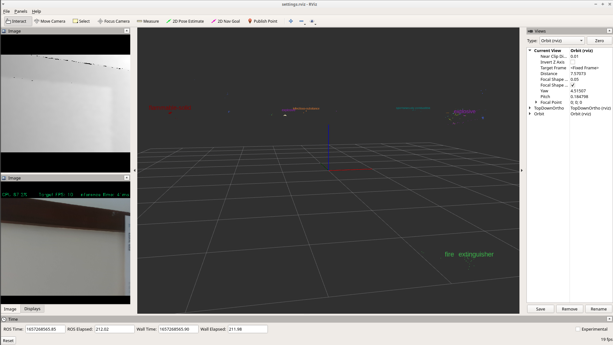
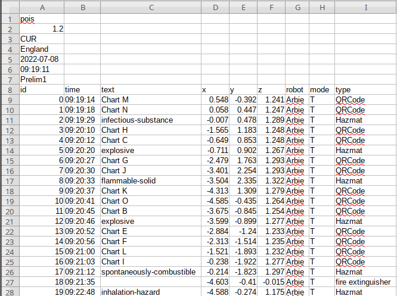

# Object detection
## Install dependencies
### Install ROS (if you haven't already)
```bash
sudo sh -c 'echo "deb http://packages.ros.org/ros/ubuntu $(lsb_release -sc) main" > /etc/apt/sources.list.d/ros-latest.list'
sudo apt-get install curl
curl -s https://raw.githubusercontent.com/ros/rosdistro/master/ros.asc | sudo apt-key add -
sudo apt update
# ROS_DISTRO=melodic # ubuntu18
ROS_DISTRO=noetic # ubuntu20
sudo apt-get install ros-$ROS_DISTRO-desktop
echo "source /opt/ros/$ROS_DISTRO/setup.bash" >> ~/.bashrc
source /opt/ros/$ROS_DISTRO/setup.bash
# sudo apt-get install catkin python-rosdep python-rosinstall python-rosinstall-generator python-wstool build-essential # ubuntu18
sudo apt install python3-rosdep python3-rosinstall python3-rosinstall-generator python3-wstool build-essential # ubuntu18
sudo rosdep init
rosdep update
```

### Install dependencies and compile
```
git clone https://github.com/ea520/object-detection && cd object-detection
```
```bash
./install_dependencies.sh
```
```bash
./compile.sh -DCMAKE_BUILD_TYPE=RELEASE
```

## Run the code

### If you have a camera, you can check the object detection/QR code viewer
```bash
source ./devel/setup.bash
```
```bash
rosrun object_detection detect2d.sh --gpu
```

### If you have a couple Gb storage:
Download [this rosbag file](https://drive.google.com/drive/u/1/folders/1Y2u8pNS8XX3paCsEkHHC_YGhx59B44ql) and save it.
This is a 1-minute recording of the sensor streams

```bash
rosbag decompress recording.bag
```
```bash
rosrun object_detection detect3d.sh rosbag_path:=/full/path/to/recording.bag gpu:=True
```

### If you have access to the RealSense cameras:
```bash
rosrun object_detection with-realsense.sh gpu:=True #rviz:=False
# add the rviz:=False to just produce the output csv file and don't visualise it.
# positions in the file are relative to the tracking camera's coordinate system
# you can include the arguments to rs_d400_and_t265.launch here as well
```

With any luck, you'll see the following screen:

The contents of src/robocup-object-detection/object_detection/output.csv

