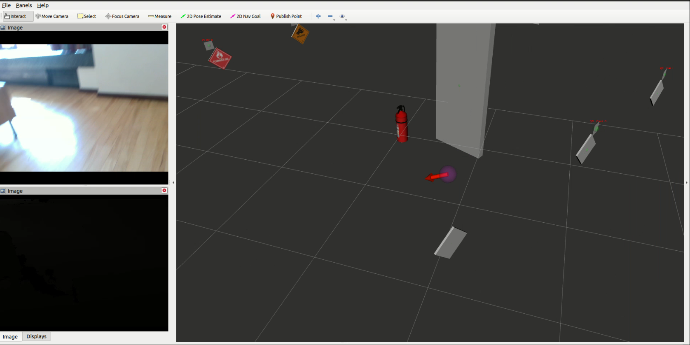

# Object detection
- Install [ros](http://wiki.ros.org/noetic/Installation/Ubuntu) and [openvino](https://docs.openvino.ai/latest/openvino_docs_install_guides_installing_openvino_from_archive_linux.html#doxid-openvino-docs-install-guides-installing-openvino-from-archive-linux)
- Source /opt/intel/openvino_2022/setupvars.sh 
- `git clone https://github.com/ea520/object-detection.git && cd object-detection`
- `rosdep install --from-paths .`
- `catkin_make`
- Wait about an hour for the first compile (it needs to download and compile opencv first time). Subsequent compiles should only take a few seconds.
- If you make changes to the code and get an error like this: `error while loading shared libraries: libopencv_imgcodecs.so.406: cannot open shared object file: No such file or directory`, a temporary fix would be to add build/install/lib to LD_LIBRARY_PATH.
## Run the code

### If you have a few Gb storage:
Download [this rosbag file](https://drive.google.com/drive/u/1/folders/1Y2u8pNS8XX3paCsEkHHC_YGhx59B44ql) and save it.
This is a 1-minute recording of the sensor streams

```bash
rosbag decompress recording.bag
```
```bash
roslaunch object_detection detect_objects.launch rosbag_path:=/full/path/to/recording.bag gpu:=True
```

### If you have access to the RealSense cameras:
```bash
roslaunch object_detection detect_objects.launch  gpu:=True #rviz:=False
# you can include the arguments to rs_d400_and_t265.launch here as well
```

With any luck, you'll see the following screen:


